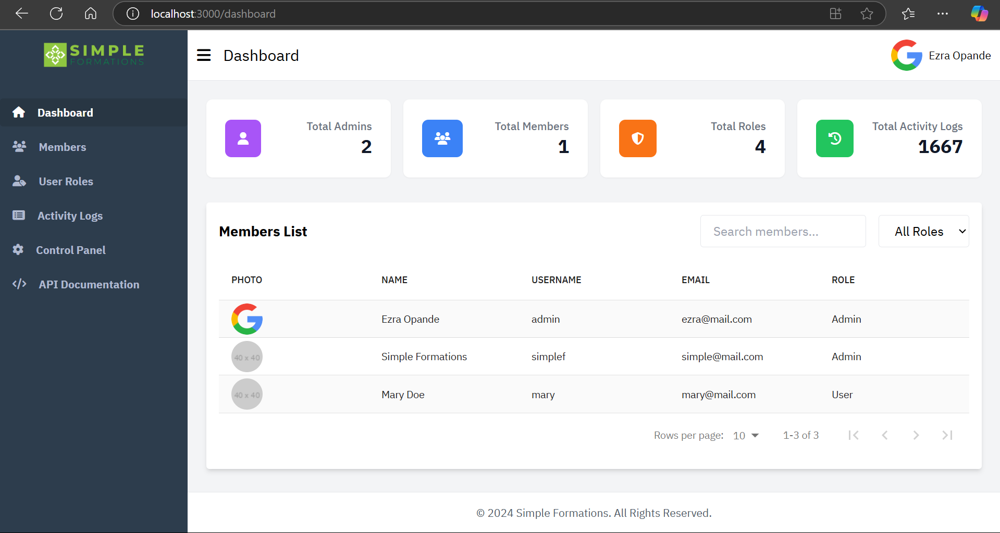
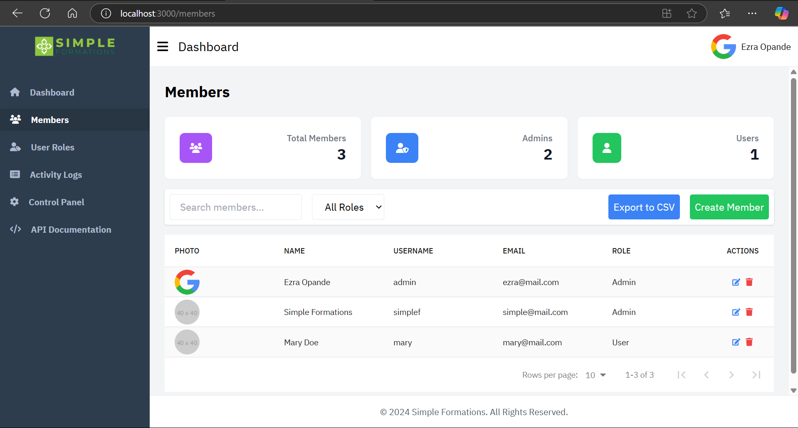
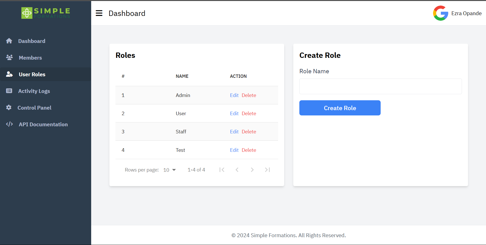
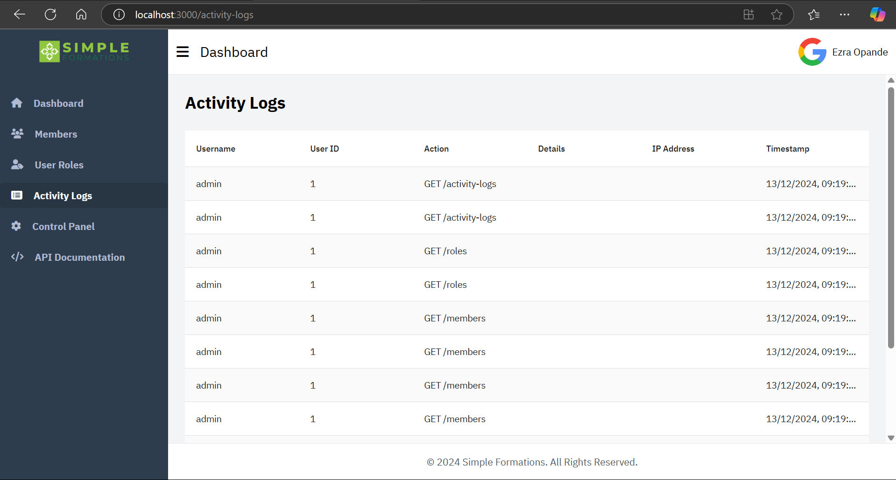
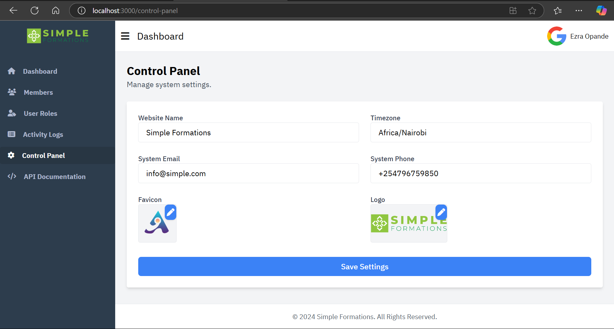
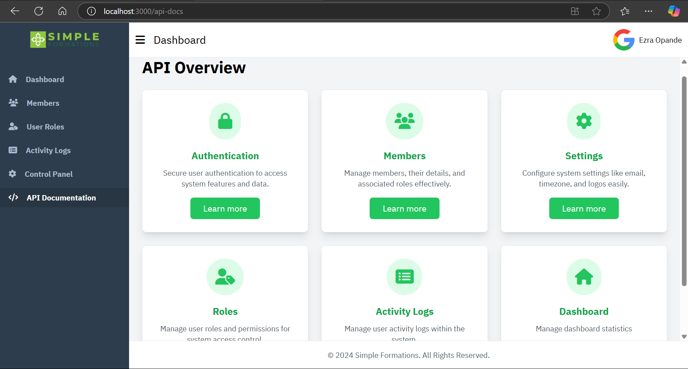
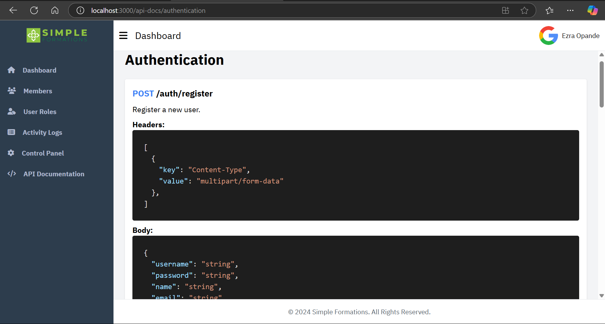

# MERN Member Management System

Welcome to the MERN Member Management System, a robust and responsive application for managing members efficiently. Built with modern technologies, this project showcases a seamless integration of a powerful Node.js backend and an intuitive React.js frontend.

## Features

### 1. User Authentication

- Secure user registration and login using JWT.
- Middleware-protected routes for enhanced security.

### 2. Member Management

- Full CRUD operations for member profiles.
- Supports fields like Name, Email, Date of Birth, Role, and Profile Picture.
- File upload for profile pictures with backend storage and retrieval.

### 3. Dashboard

- **Admin Dashboard:**
  - Search, pagination, and sorting for managing members efficiently.
  - View statistics such as total members, activity logs, and role distribution.
- **User Dashboard:**
  - Users can update their profiles.
  - View personal activity logs detailing user-specific actions.
- **Activity Logs:**
  - Tracks all CRUD operations performed on members, linked to user IDs.

### 4. Responsive User Interface

- Designed with Tailwind CSS for a clean and responsive UI.
- Utilizes IBM Plex Sans font for modern and professional typography.

### 5. Navigation

- React Router for seamless navigation between pages.
- Protected routes to restrict access based on user roles.

### 6. State Management

- Uses Context API or Redux for managing global application state.

### 7. Advanced Features

- Filters, pagination, and sorting for enhanced usability.
- Database normalization to ensure efficient and relational data handling.

## Technologies Used

### Frontend

- **React:** JavaScript library for building user interfaces.
- **React Router:** For navigation and routing.
- **Tailwind CSS:** Utility-first CSS framework for rapid UI design.

### Backend

- **Node.js:** JavaScript runtime for server-side programming.
- **Express:** Minimalist web framework for Node.js.
- **SQLite:** Lightweight relational database with normalized tables.

### Authentication

- **JWT:** Secure token-based user authentication.

## Getting Started

### Prerequisites

- Node.js and npm installed on your machine.

### Installation

1. **Clone the Repository**

   ```bash
   git clone https://github.com/ezraopande/Member-Management.git
   cd member-management
   ```

2. **Backend Setup**

   - Navigate to the backend directory:
     ```bash
     cd backend
     ```
   - Install dependencies:

     ```bash
     npm install
     ```

     ```bash
     npm install cross-env --save-dev
     ```

   - Run the development server:
     ```bash
     npm start
     ```

3. **Frontend Setup**

   - Navigate to the frontend directory:
     ```bash
     cd frontend
     ```
   - Install dependencies:
     ```bash
     npm install
     ```
   - Run the development server:
     `bash
npm start
`

### Note

- If you're having challenges installing dependencies, delete the node_mudules folders present in the frontend and backend folders.

4. **Database Setup**
   - SQLite file is already available in the backend folder.

### Usage

- Access the application in your browser at `http://localhost:3000`.
- Log in with the following Admin Details

```bash
    username:   admin
    password:   admin
```

- Explore features like member management, dashboard statistics, and more.

### Screenshots

- .
- .
- .
- .
- .
- .
- .

## Contact

For questions, feedback, or collaborations, feel free to reach out:

- **Email:** ezraopande@gmail.com
- **Phone:** +254796759850

---

_This project is maintained by [Ezra Opande](https://github.com/ezraopande)._
